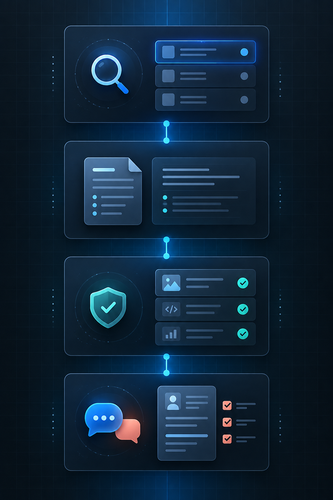
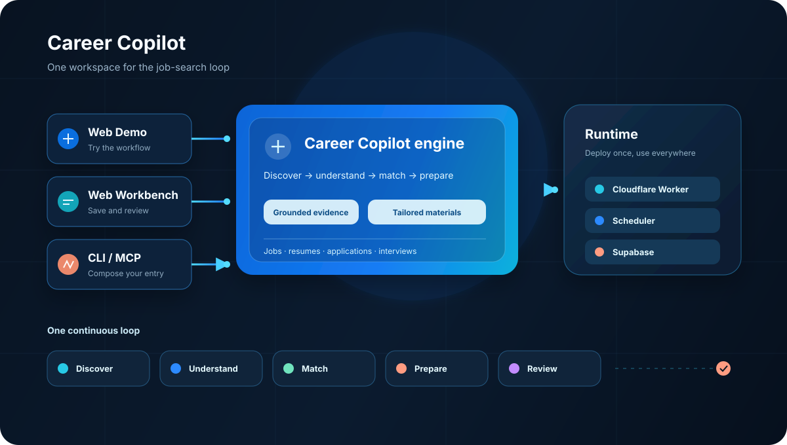

<div align="center">


# Career Copilot

**证据驱动的 AI 求职操作系统**

聚合岗位 · 拆解 JD · 定制简历 · 跟踪投递 · 面试复盘

[](https://opensource.org/licenses/MIT)
[](package.json)
[](https://career-copilot-v2.photomagic.workers.dev)
[](https://codebuddy.cn)
[](https://docs.anthropic.com/en/docs/claude-code)
[](https://github.com/openai/codex)
[](https://github.com/anthropics/opencode)
[](https://modelcontextprotocol.io)
[](https://github.com/ronineymessjr-sudo/career-copilot/issues)

</div>

---

## 求职不是海投，是系统战

投了 100 份简历、聊了 N 个 AI、聊天记录越堆越多——求职变成了一场没有记忆的数据游击战。

**Career Copilot** 是你的个人求职操作系统：

- 围绕**真实项目证据**构建画像，而不是让 AI 凭空编造
- 每份推荐都可追溯到岗位要求和你的匹配证据
- 每次 AI 动作都停在**人工确认前**，你始终掌控决策
- 跨平台接入：支持 WorkBuddy、Claude Code、OpenAI Codex、OpenCode 及任意 MCP 客户端

> "AI 应该帮你做决策，而不是代替你做决定。"

---

## 六大核心能力



| 能力 | 一句话说明 |
|------|-----------|
| **岗位发现** | 聚合 ATS 与国内主流招聘平台的公开职位 |
| **JD 深拆** | 自动提取必备条件、加分项、隐性偏好，生成匹配与缺口清单 |
| **AI 简历定制** | 基于真实项目证据生成岗位定制版简历，并检查 ATS 关键词覆盖率 |
| **投递管理** | 从「待投」到「Offer」的管线管理，默认停在人工确认前 |
| **面试复盘** | 面试准备包、结构化复盘、技能缺口追踪 |
| **数据洞察** | 渠道、公司规模、简历版本转化率分析，每周自动回顾 |

---

## 谁适合用

- **在校生 / 应届生**：把课程项目、实习、竞赛整理成可投递的证据
- **社招跳槽者**：管理多岗位投递进度，针对性准备面试
- **转行者**：识别目标岗位的技能缺口，用证据弥补履历断层
- **自由职业 / 创作者**：把零散作品整理成可验证的职业档案

---

## 五种使用方式

Career Copilot 适配所有主流 AI 编码平台，选你顺手的方式：

| 入口 | 适合场景 | 支持的 AI 平台 |
|------|---------|---------------|
| **Web App** | 日常求职操作、可视化看板 | 独立使用（无需 AI 编码工具） |
| **CLI** | 命令行快速搜索、生成简历 | 任意终端 — Claude Code CLI · Codex CLI · OpenCode · 普通终端 |
| **MCP 工具** | 接入任意支持 MCP 的 Agent | ✨ 全平台通用：WorkBuddy · Claude Code · Codex · OpenCode · 自定义 Agent |
| **WorkBuddy Expert** | 对话式求职顾问 | WorkBuddy 专家中心一键安装 |
| **GitHub Actions** | 构建、部署、Smoke 与工程证据 | GitHub Actions 任意 Runner（不自动投递） |

---
## 支持的 AI 编码平台

| 平台 | 接入方式 | 状态 |
|------|---------|:--:|
| **WorkBuddy** | Expert 专家包 + MCP 工具 | ✅ 已发布 |
| **Claude Code** (Anthropic) | CLI 命令 + MCP 工具 | ✅ 兼容 |
| **OpenAI Codex** | CLI 命令 + MCP 工具 | ✅ 兼容 |
| **OpenCode** | CLI 命令 + MCP 工具 | ✅ 兼容 |
| **任意 MCP 客户端** | `/api/mcp` 端点 | ✅ 协议通用 |

> 以上平台均通过统一的 **MCP 协议** 接入。无论你在哪个 AI 助理里写代码，Career Copilot 都能作为你的求职副驾随时待命。

---

## 系统架构



Career Copilot 采用**统一引擎 + 多入口**设计，无论你用哪个 AI 编码平台：

- **Web 工作台**：可视化操作面板，独立使用
- **CLI 工具**：本地命令行，Claude Code / Codex / OpenCode / 普通终端均可运行
- **MCP 协议**：一个 `/api/mcp` 端点，让 WorkBuddy、Claude Code、Codex、OpenCode 及任意 MCP 兼容 Agent 调用全部求职能力
- **WorkBuddy 专家**：WorkBuddy 专家中心一键安装的对话式顾问

---

## 快速开始（CLI 模式）

CLI 模式完全免费、完全本地：只需要 Node.js + 一个免费的 Tavily key。

```bash
# 1. 克隆仓库
git clone https://github.com/ronineymessjr-sudo/career-copilot.git
cd career-copilot
npm install

# 2. 配置环境变量（仅需 Tavily 免费 key）
cp .env.example .env.local
# 编辑 .env.local 填入 TAVILY_API_KEY

# 3. 初始化求职画像
npm run cli -- init

# 4. 搜索岗位
npm run cli -- search

# 5. 评价排序
npm run cli -- rank

# 6. 生成简历
npm run cli -- resume
```

完整 CLI 命令见 [`AGENTS.md`](./AGENTS.md)。

---

## 核心价值

- **证据优先**：所有简历、求职信、面试回答只引用 Career Vault 中的真实证据
- **可解释推荐**：每个岗位的推荐度都附带匹配技能、缺口技能、推荐档位
- **人工确认**：平台投递、邮件发送等关键动作默认停在人工确认前
- **数据闭环**：投递结果反哺推荐模型，越用越准

---

## 反馈与社区

你的反馈会直接影响下一版迭代：

- 🐛 [提交 Bug](https://github.com/ronineymessjr-sudo/career-copilot/issues/new?template=bug_report.yml)
- ✨ [功能建议](https://github.com/ronineymessjr-sudo/career-copilot/issues/new?template=feature_request.yml)
- 💬 [综合反馈](https://github.com/ronineymessjr-sudo/career-copilot/issues/new?template=feedback.yml)

Web 端、CLI、WorkBuddy 专家、Claude Code、Codex、OpenCode、MCP 端均内置反馈入口，随时随地可以提交。

如果 Career Copilot 帮到了你，请给我们一颗 ⭐ Star —— 这对我们是很大的鼓励。

---

## 路线图

- [x] Web 端求职工作台
- [x] CLI 命令行工具
- [x] WorkBuddy Expert 封装
- [x] MCP 工具接入（WorkBuddy / Claude Code / Codex / OpenCode 通用）
- [x] 跨端反馈系统（覆盖全部 AI 编码平台）
- [ ] Data Hub 数据看板
- [ ] 多语言简历生成
- [ ] 邮件自动化（草稿 + 人工确认）
- [ ] 与更多 ATS 直连同步

---

## 许可证

[MIT License](LICENSE) — 自由使用、修改、分发。

<div align="center">

**Made with ❤️ by Career Copilot Team**

如果这个项目帮到了你，请在右上角点一颗 ⭐ Star

</div>
